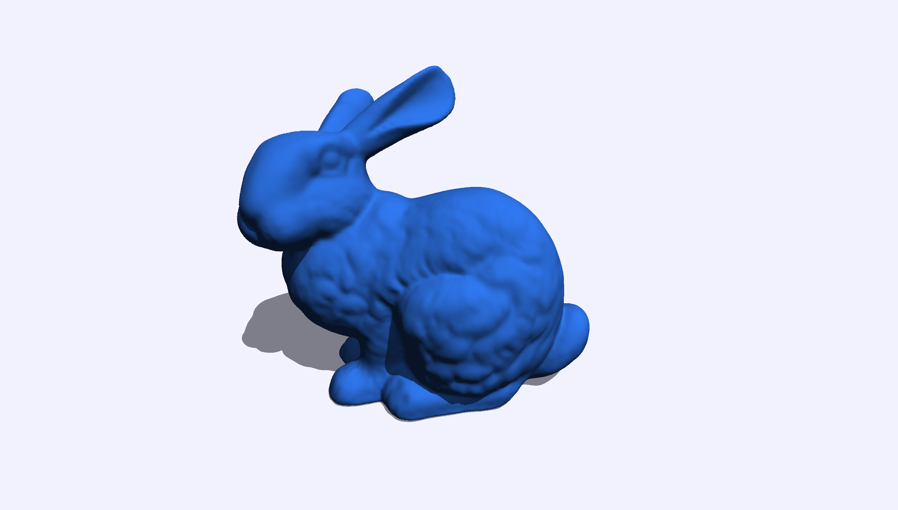

_See [PicoVDB](https://github.com/emcfarlane/picovdb) for WebGPU optimised format of NanoVDB._

# WebGPU NanoVDB

A WGSL shader library for accessing NanoVDB sparse volumetric data in WebGPU compute shaders.



**[Live Demo →](https://emcfarlane.github.io/webgpu-nanovdb/demo/)**

## Overview

This repository provides `pnanovdb.wgsl` - a port of the [PNanoVDB C API](https://github.com/AcademySoftwareFoundation/openvdb/blob/master/nanovdb/nanovdb/PNanoVDB.h) to WGSL for use in WebGPU compute shaders.

## Usage

```wgsl
// Include the library in your compute shader
// (concatenate pnanovdb.wgsl with your shader code)

@group(0) @binding(2) var<storage> nanovdb_buffer: array<u32>;

@compute @workgroup_size(8, 8)
fn main() {
    // Create buffer handle
    let buf = pnanovdb_buf_t(0, arrayLength(&nanovdb_buffer));
    
    // Access grid data
    let grid = pnanovdb_grid_handle_t(0u);
    let tree = pnanovdb_grid_get_tree(grid);
    let root = pnanovdb_tree_get_root(buf, tree);
    
    // Sample voxel data
    var accessor: pnanovdb_readaccessor_t;
    pnanovdb_readaccessor_init(&accessor, root);
    let value = pnanovdb_readaccessor_get_float(buf, &accessor, coord);
}
```

## Related Projects

- **[OpenVDB](https://github.com/AcademySoftwareFoundation/openvdb)** - Sparse volume data structure library
- **[NanoVDB](https://developer.nvidia.com/nanovdb)** - GPU-optimized sparse volumes
- **[PicoVDB](https://github.com/emcfarlane/picovdb)** - WebGPU native format for sparse volumes

## License

Licensed under the Apache License, Version 2.0. See [LICENSE](LICENSE) for details.

Built on technologies from the Academy Software Foundation.
